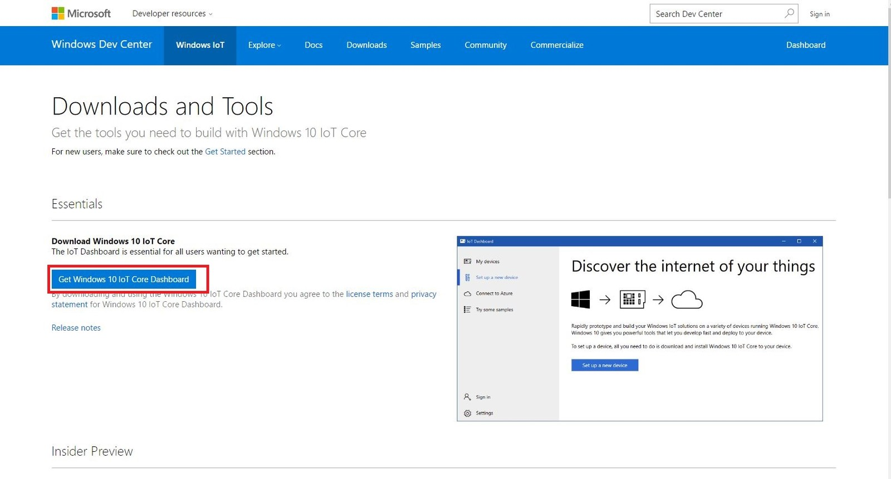
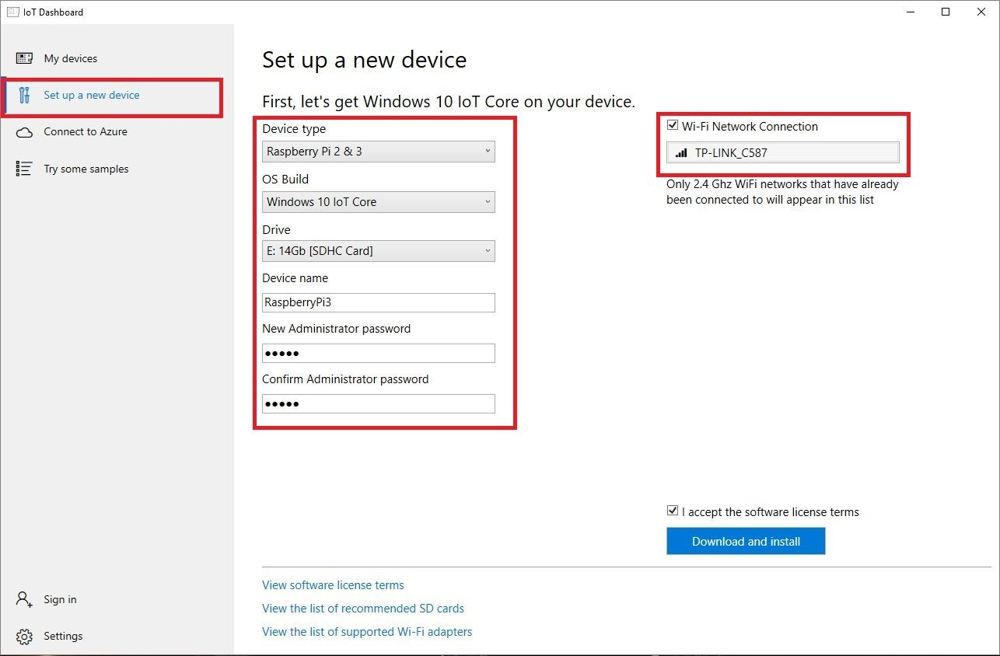
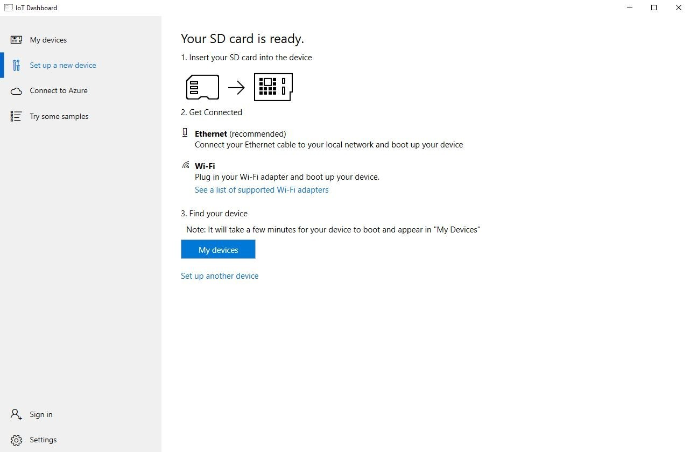
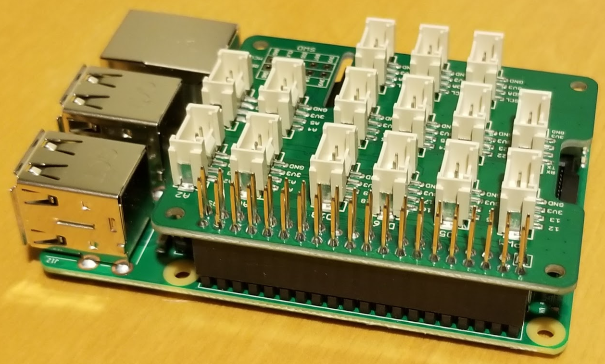
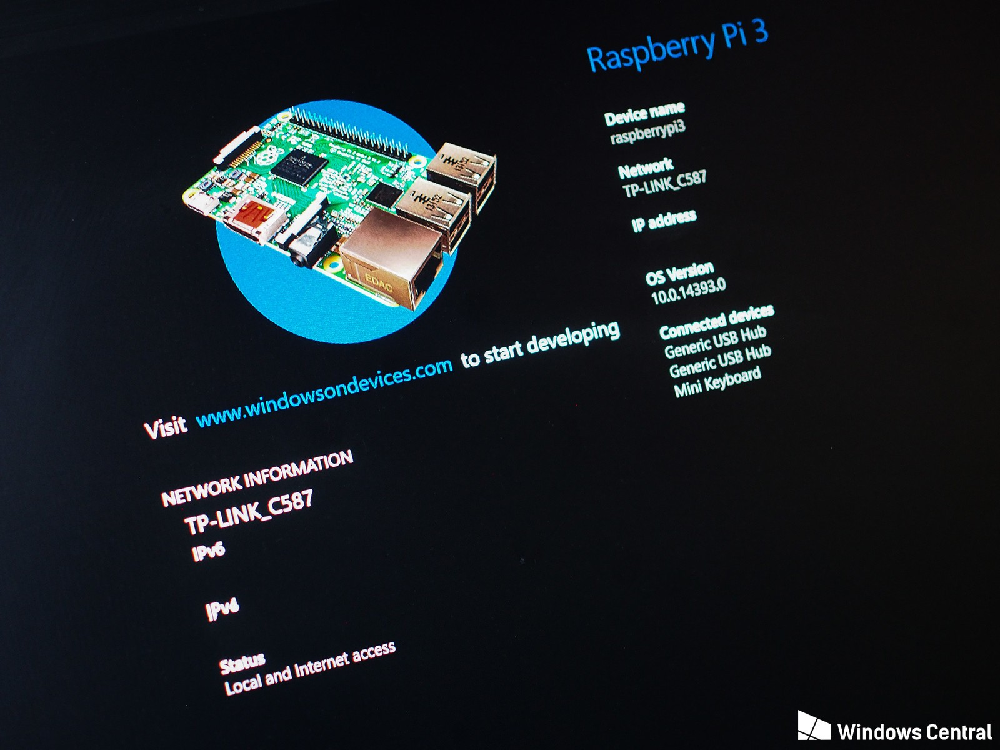
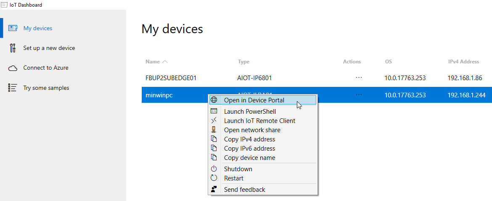
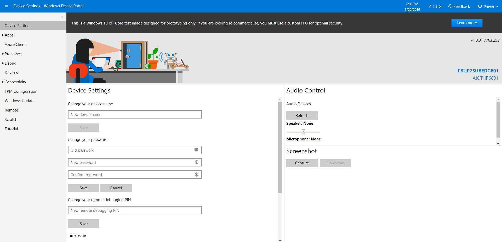
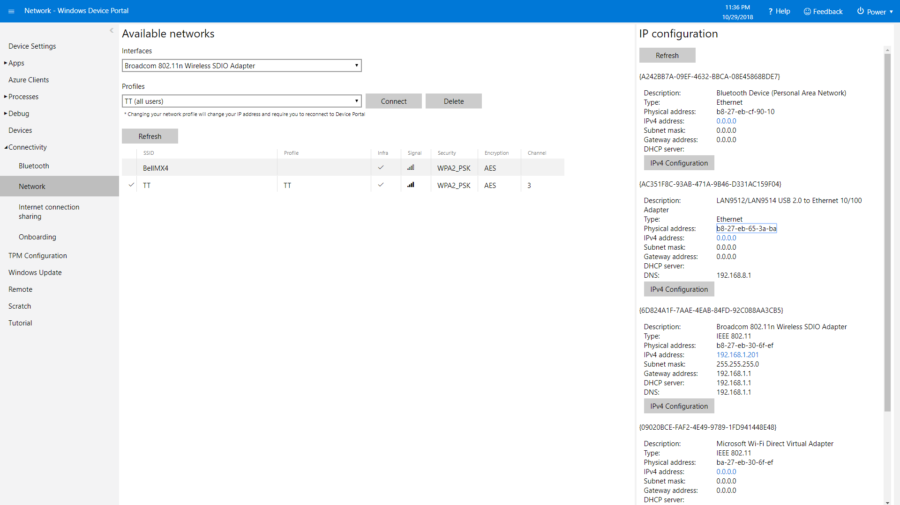

Document purpose
================

This lab document is to help students with the FarmBeats Student Kit hardware
setup. It includes installing Windows 10 IoT Core on your Raspberry Pi,
installing the sensor software, connecting the sensors and getting the device
claim code needed to register the device in the Student Kit portal and Azure IoT
Central cloud service.

Setting up your sensor device
=============================

Windows 10 IoT Core is a version of Windows 10 that is optimized for smaller
devices with or without a display, and that runs on small devices like the
Raspberry Pi 3. Windows 10 IoT Core utilizes the rich, extensible Universal
Windows Platform (UWP) API for building rich Internet of Things solutions.

Installing Windows 10 IoT Core on you Raspberry Pi 3
----------------------------------------------------

1.  Go to the [Windows 10 IoT Developer
    center](https://redirect.viglink.com/?format=go&jsonp=vglnk_154802968858413&key=b7c8c670b7fda5a86f406ea51bd7cdf6&libId=jr5kq1mm01020gme000DAbiba79vk&loc=https%3A%2F%2Fwww.windowscentral.com%2Fhow-install-windows-10-iot-raspberry-pi-3&v=1&out=https%3A%2F%2Fdeveloper.microsoft.com%2Fen-us%2Fwindows%2Fiot%2FDownloads.htm&ref=https%3A%2F%2Fwww.google.com%2F&title=How%20to%20install%20Windows%2010%20IoT%20Core%20on%20Raspberry%20Pi%203%20%7C%20Windows%20Central&txt=Windows%2010%20developer%20center).

2.  Click **Get Windows 10 IoT Core Dashboard**

>   https://www.windowscentral.com/sites/wpcentral.com/files/styles/xlarge/public/field/image/2017/02/w10-iot-steps-1.jpg?itok=smbzdS2C

1.  Install the dashboard application and open it

2.  Select **set up a new device** from the side bar

3.  Select the Select the options as shown in the image below. Make sure you
    select the correct drive for your microSD card and give your device a name
    and admin password.

>   Windows 10 IoT on Raspberry Pi

1.  Select the Wi-Fi network connection you want your Raspberry Pi to connect
    to, if required. Only networks your PC connects to will be shown. The Wi-Fi
    information from your PC will be shared with the Raspberry Pi. (note: this
    is not 100% reliable)

2.  Select the **I accept the software license** terms and click **download and
    install.**

The application will now download the necessary files from Microsoft and flash
them to your microSD card. It'll take a little while, but the dashboard will
show you the progress.

>   Windows 10 IoT on Raspberry Pi

Once the image has been installed on the microSD card, it's time to eject it
from your PC and go over to the Raspberry Pi.

Connecting to the LAN and Internet
----------------------------------

>   During the creation of the device image you had the option of having the
>   Raspberry Pi join the Provisioned during SD Card build-

1.  Wi-Fi
    <https://docs.microsoft.com/en-us/windows/iot-core/connect-your-device/setupwifi>

2.  Ethernet Cabled

3.  Remote Client

4.  Mouse, Keyboard, Monitor

Connect Sensors and Powering Up!
--------------------------------

1.  Add Grove Base Hat to your Raspberry Pi. Match the end pins up and press
    down firmly.

1.  Plug the Soil Moisture Sensor into socket A2 and the A4 if you have a second
    one

2.  Plug the Light Sensor into socket A0.

3.  Plug the BME280 Temperature Sensor into the bottom left I2C socket

4.  Insert the SD card into the underside of the Raspberry Pi

5.  Insert one end of the Ethernet cable into the Raspberry Pi and the other end
    into a network port with internet access. Likely on your router.

6.  Plug in HDMI and connect your Raspberry Pi to a monitor (only for setup)

7.  Plug the large end of the micro USB cable into the power adapter

8.  Plug the small end of the micro USB cable into the Raspberry Pi and Power
    Up!

The setup process.
------------------

Unlike your Windows 10 desktop, laptop or tablet, there's not much of a setup
process.

1.  You'll be asked to choose a language

2.  Select the level of information you want to send back to Microsoft.

3.  Select the privacy setting for sharing your location.

4.  If not already connected via Ethernet cable or with Wi-Fi details it was
    provided when you installed the SD card then you will be asked to enter your
    Wi-Fi password to connect to the web. If needed, connect a keyboard to
    complete this step.

It'll take a couple of minutes, but when booted up you'll see the Windows 10 IoT
Core splash screen. There is not much to see here, the Windows 10 Operating
System part is designed to disappear, since once you deploy an app to your
Raspberry Pi, it becomes that app. There's no flipping in and out of Windows and
launching apps like you would on a PC.

1.  When booted, check that you have a valid IP address.

Now you can go back to the dashboard application on your PC, and you'll see your
Raspberry Pi listed as one of your devices.

1.  In the Windows IoT Dashboard select the **My devices** tab on the top left.

Configuring Windows 10 IoT Core 
--------------------------------

1.  In the **My devices** page right click on your Raspberry Pi to access the
    menu.

2.  Select the **Open in device portal** menu item

1.  Login to Windows Device Portal using the username **Administrator** and the
    password you used when making the SD card.

The [Windows Device
Portal](https://docs.microsoft.com/en-us/windows/iot-core/manage-your-device/DevicePortal)
(WDP) lets you configure and manage your device remotely over your local
network.

1.  If you are on Ethernet and want to switch to Wi-Fi select **Connectivity**
    on the menu on the left.

2.  Record the Mac address of your LAN card

1.  Check for Windows Updates (Tests internet connectivity)

2.  Change your Time zone (optional)

Installing Gateway Application
------------------------------

1.  Download and unzip the latest Gateway Application software

2.  Install Application onto Windows 10 IoT Core

3.  Set Application to startup when device boots

Deploy device and plant together near a window
----------------------------------------------

1.  Find and pot and plant a seed

2.  Position FarmBeats Labs Indoor M1 unit

3.  Insert Moisture Sensor into Plant Soil

4.  Position Temp / Humidity Sensor

5.  Setup Web Camera (optional)
