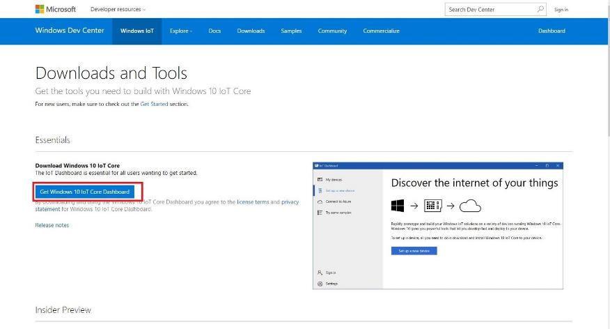
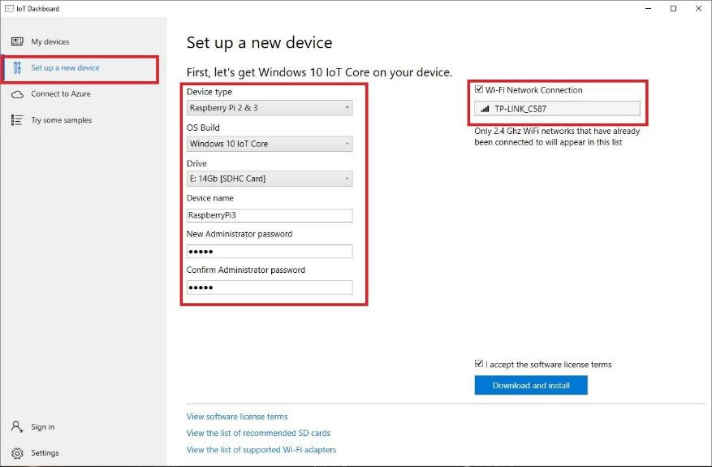
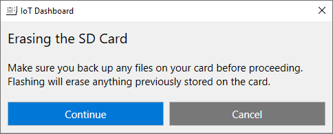
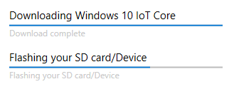
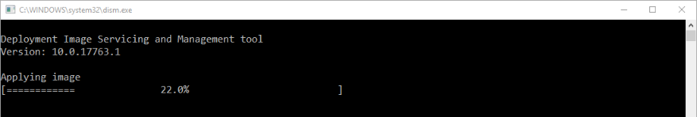
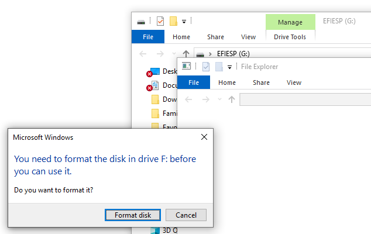
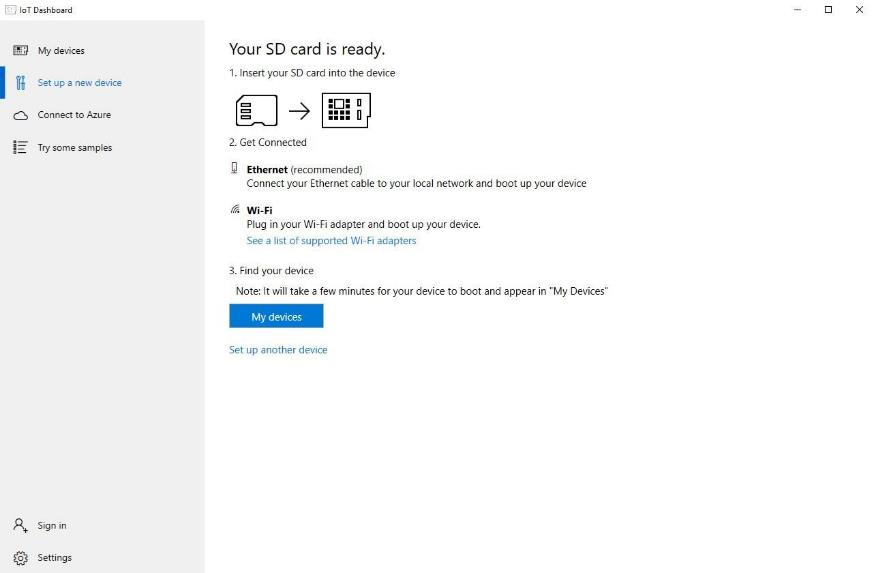

Install Windows 10 IoT Core on your SD card
-------------------------------------------

Windows 10 IoT Core is a version of Windows 10 that is optimized for smaller
devices with or without a display, and that runs on small devices like the
Raspberry Pi 3. Windows 10 IoT Core utilizes the extensible Universal Windows
Platform (UWP) API for building rich Internet of Things solutions.

*This step may be optional: Some of the kits are shipped with the SD card
pre-installed. If your SD card is NOT still in the packet then you can skip this
step and jump straight to the Assembling your FarmBeats Student Kit.*

Preparation
-----------

-   This step can only be completed on a Windows PC and is not supported on a
    Mac Book or Chromebook.

-   Have a Micro SD Card with an adapter to be able to use it on your PC

Download the Windows 10 IoT Core Dashboard
------------------------------------------

-   Go to the [Windows 10 IoT Core Dashboard Documentation
    Page](https://docs.microsoft.com/en-us/windows/iot-core/connect-your-device/iotdashboard)

-   Select **Get Windows 10 IoT Core Dashboard**

-   Install the dashboard application and open it

Installing Windows 10 IoT Core
------------------------------

-   Select **set up a new device** from the side bar.

-   Insert the microSD card into your computer or laptop. You may need to use
    the SD card adapter and plug it into a USB port on your PC.

-   Select the options as shown in the image below for device type and OS Build.

-   Make sure you select the correct drive for your microSD card.

-   Give your device a friendly name and **your administrator password**. You
    will need to write down the password to use later.

-   If your device was supplied with a pre-installed operating system on the SD
    card then your administrator password is going to be “**p\@ssw0rd”**

-   If you are on a laptop or desktop with a Wi-Fi adapter you may be able to
    select the Wi-Fi network connection you want your Raspberry Pi to connect
    to. Only wi-fi networks your PC already connects to will be shown. The Wi-Fi
    information from your PC will be shared with the Raspberry Pi.

-   Select the **I accept the software license** terms and click **Download and
    install.**

-   Select continue on the Erasing the SD Card warning.

-   The application will now download the necessary files from Microsoft and
    flash them to your microSD card. It'll take a little while, but the
    dashboard will show you the progress.

-   You will get a security prompt for the Deployment Image Servicing and
    Management tool, click Yes to allow this to run.

-   When the SD card flashing is complete you will get a bunch of File Explorer
    instances launch and the PC recognizes the different partitions on the SD
    card. Do not format the disk. Remove the SD card from your PC and press
    cancel on the Format dialog and close all the remaining File Explorer
    windows.

-   Once the image has been installed on the microSD card, you will get the
    screen and message **“Your SD card is ready”**.

