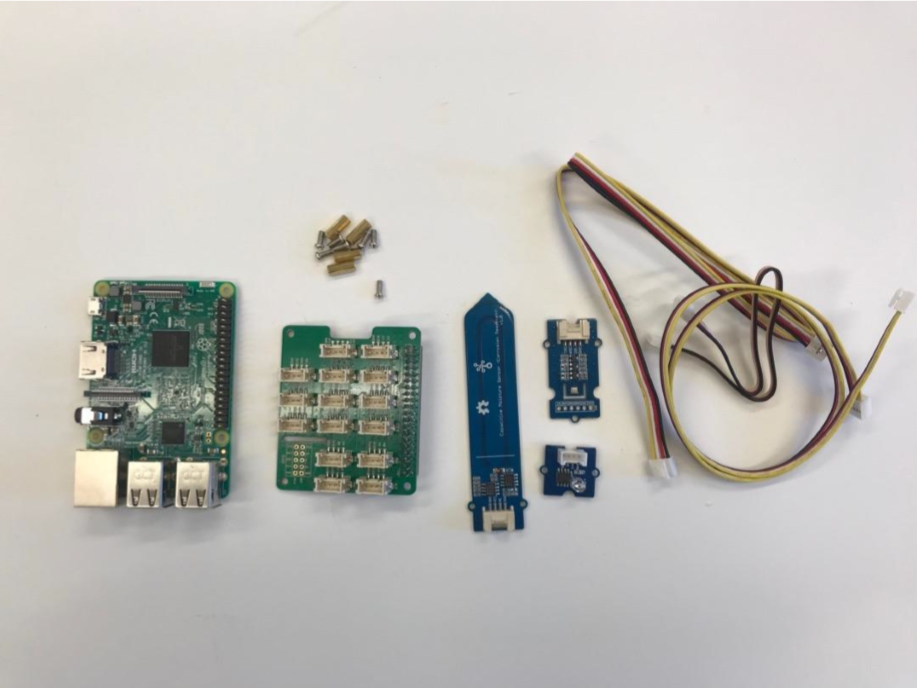
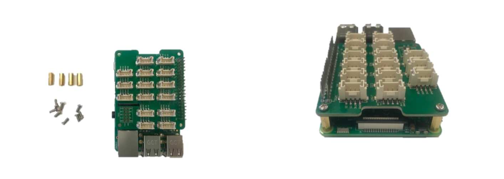
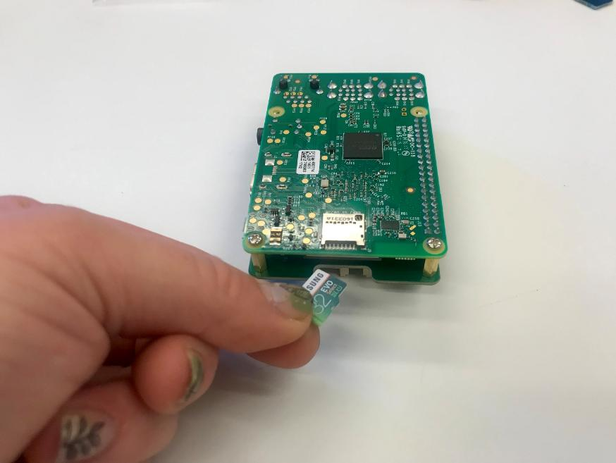
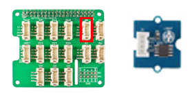
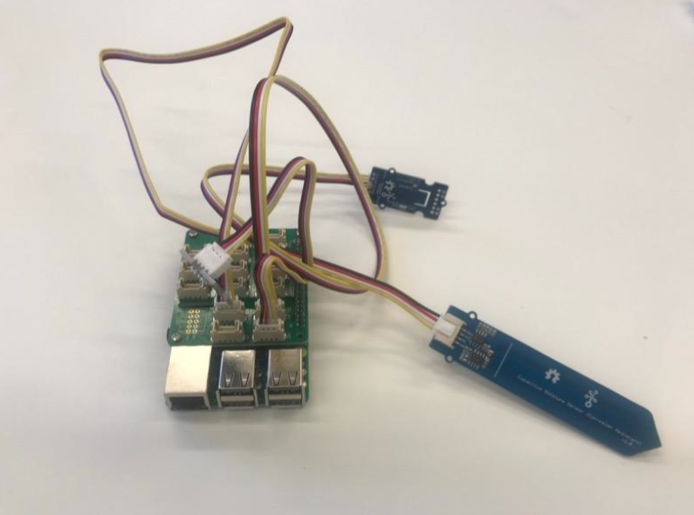

Assemble your FarmBeats Student Kit Hardware
============================================

The FarmBeats Student Kit has been sent in parts and needs to be assembled
before you can connect it to the internet or install the sensor software.

Preparation
-----------

-   Gather the Raspberry Pi, sensors, sensor cable connecters, the Grove Base
    Hat and small bag of screws from the kit.

-   You will also need a small screwdriver that fits the screws.

Assembling your Student Kit
---------------------------

-   Add the Grove Base Hat to your Raspberry Pi. Match the end pins up and press
    down firmly. Look at it from all angles to ensure that it is correctly
    connected.

-   Screw in the supports on the side opposite the pins to stop the other side
    of the Grove Base Hat from collapsing onto the Raspberry Pi. This requires a
    small screwdriver.

-   Insert the SD card into the Raspberry Pi slot on the underneath.

-   Plug the Capacitive Soil Moisture Sensor into socket A2. If you have a
    second one plug it into A4.

-   Plug the Light Sensor into socket A0.

-   Plug the Temperature, Humidity and Barometer Sensor (BME280) into the bottom
    left I2C socket.

-   Once all your sensors are plugged in you should have something that looks
    like this.

Next Steps
----------

You have now assembled your FarmBeats Student Kit. You can now proceed to [Step
1c – Identify your unique Device
ID](https://github.com/farmbeatslabs/studentkit/blob/master/Indoor-m1/1c_Identify_your_unique_Device_ID.md)
