Identify you unique Device ID
=============================

To register your Microsoft FarmBeats Student Kit you first must identify your
device unique ID and then follow the registration process on the FarmBeats web
portal.

To gather the device ID you must connect your device to the Internet, identify
its IP address to access Windows IoT Dashboard and then locate the device ID.

The following steps will guide you through this process.

Preparation
-----------

-   Complete [Step 1b – Assemble your FarmBeats Student
    Kit](https://github.com/farmbeatslabs/studentkit/blob/master/Indoor-m1/1b_Assemble_your_FarmBeats_Student_Kit_Hardware.md)

-   Gather the Raspberry Pi, ethernet cable, micro USB cable, and power adapter
    from the FarmBeats student kit.

-   Find access to a computer mouse, keyboard, monitor, and HDMI cable.

-   Verify that a micro SD card is already inserted in the Raspberry Pi. If not,
    please refer to the Assemble your FarmBeats Student Kit Hardware guide
    before continuing with this process.

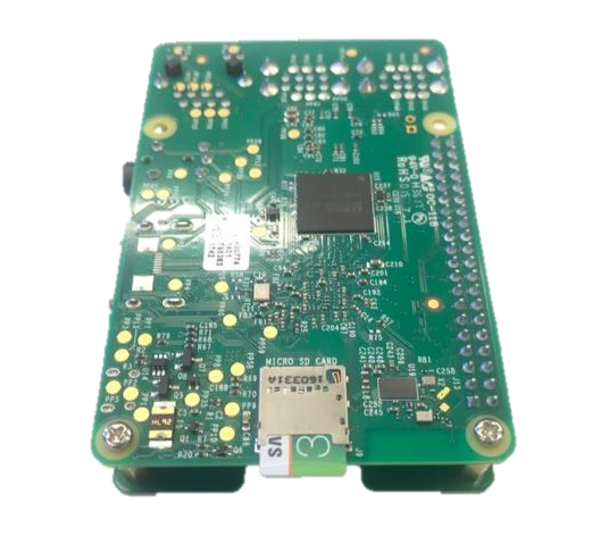

Connecting to the Internet
--------------------------

There are multiple options to getting your Raspberry Pi online and reachable by
your PC. It’s essential to have your Raspberry Pi and PC connected to the same
network.

*Note: Internet connectivity and device to device communication is the area that
often requires the most troubleshooting. See Known Issues and Frequently Asked
Questions if you are having issues getting your device online.*

-   **To connect with an Ethernet Cable** – Plug one side of the LAN cable into
    the Raspberry Pi and the other into the same Ethernet Hub or Switch that
    your PC is plugged into.

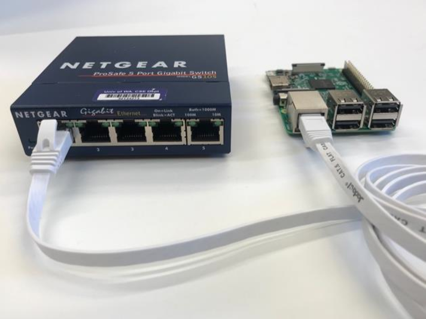

-   **To connect with a Wi-Fi connection** – follow the steps later in this
    document

Plug in the Mouse, Keyboard, Monitor
------------------------------------

The easiest way to troubleshoot connectivity issues and see what is going on
with your networking status is to connect a mouse, keyboard and monitor to the
Raspberry Pi device. This can help you provision wi-fi or lookup the IP address
if you are plugged into ethernet. You can use the console to see the network IP
address. There is a command line interface provided when the device is booted
that lets you do troubleshooting commands like *ping* and *ipconfig /all*.

-   Plug in the mouse and keyboard to the Raspberry Pi USB

-   Plug in the HDMI monitor to the Raspberry Pi HDMI and power on the computer
    monitor

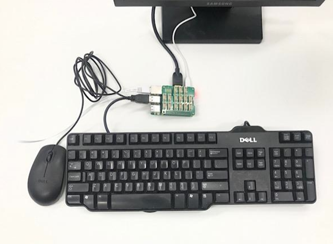

Power on your device
--------------------

-   Plug the large end of the micro USB cable into the power adapter and insert
    power adapter into a power source

-   Plug the small end of the micro USB cable into the Raspberry Pi and Power
    Up! A red light should shine on the motherboard.

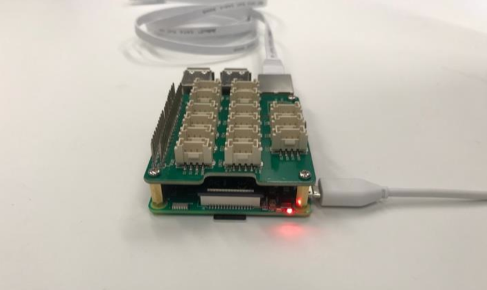

-   Booting the device until it’s ready to use takes a few minutes. You should
    see the Windows Logo within a few seconds and be able to watch this process
    on the monitor.

-   If you see nothing on the screen, check the screen is on, check the input
    source on the screen, check the HDMI cable is plugged in at both ends, and
    check that the SD card is installed, and check that the SD card has software
    installed.

The “out of the box” setup process.
-----------------------------------

When powered on for the first time you need to do a few steps on the device to
complete the operating system installation and use the mouse, keyboard and
monitor to configure your device and test you are connected to the internet.

-   On the first couple of screens you will see a welcome to Windows 10 IoT Core
    screen and be asked to choose a language, select the level of information
    you want to send back to Microsoft, and select the privacy setting for
    sharing your location.

-   The next screen will allow you to configure your Wi-Fi details. If the
    device is connected to the Ethernet this is an optional step.

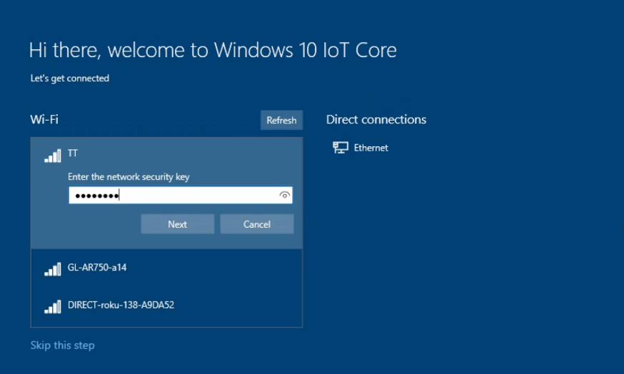

-   When configuration is finished you will be presented with the Windows IoT
    Core Default Application. This default application provides you with the
    ability see basic device information, install sample applications and
    provides a command line interface.

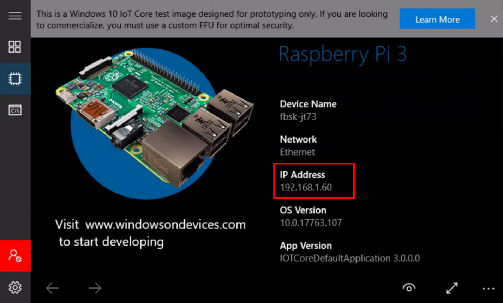

Connecting to the Internet via Ethernet or Wi-Fi

If connected to the ethernet or wi-fi during the setup process then you should
have an IP already showing as in the last image above.

-   To test your device has internet connectivity select the command line icon
    on the left.

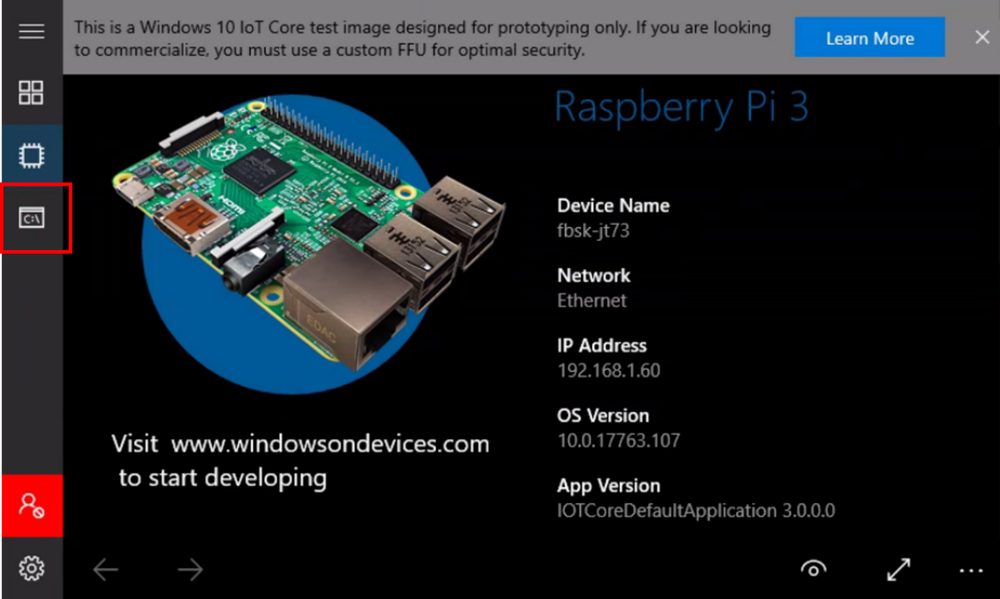

-   Type “ping 1.1.1.1” and you should get a response from a global DNS server.
    (eg. Reply from 1.1.1.1: bytes=32 time=11ms TTL=57 )

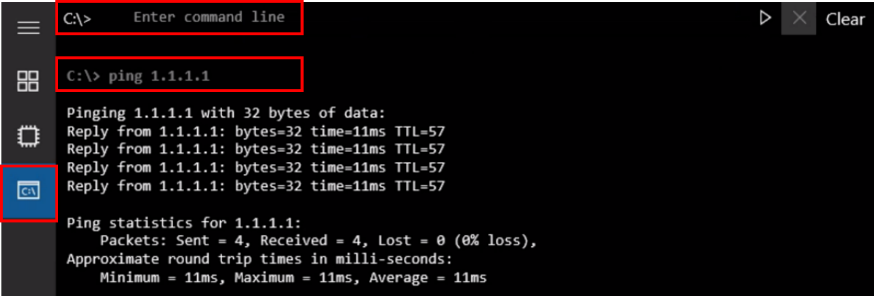

-   To configure Wi-Fi on your device press the settings button in the bottom
    left of the default application (outlined in red below)

./media/image9.png
------------------

-   Select Network & Wi-Fi

Obtaining the unique Device ID
==============================

There are two ways to collect the Device ID

-   Typing “ipconfig /all” using the Mouse, Keyboard and Monitor.

-   Remotely through the device Windows Device Portal

*Important Note: You must select the Physical address from the LAN card, not
Wi-Fi, Bluetooth or any other connection type. Description starts with LAN. Type
is Ethernet.*

*Note: All remaining steps can be done on nearly any device with a browser.
However, the Windows Device Portal is not supported on Safari. Please use Chrome
or Firefox to remotely administer your Windows 10 IoT Core device.*

### Obtaining the Device ID using Mouse, Keyboard and Monitor

To obtain the Device ID is using the Mouse, Keyboard and Monitor complete the
following steps.

-   On the Raspberry Pi, select the Command Line on the left menu.

-   Type “**ipconfig /all**” and scroll up to the Ethernet adapter Ethernet:
    section. Here you can see that the Physical Address that we are using for
    the **Device ID** is **b827eb653aba.**

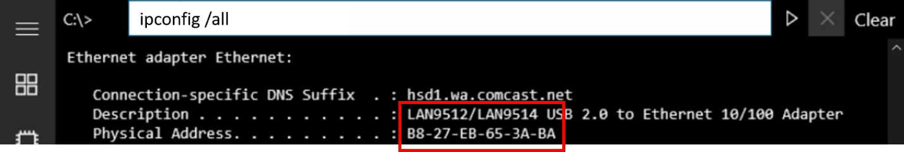

### Using the Windows Device Portal to obtain the Device ID

-   At this point you can remotely administer the device via a web browser. To
    access the device via a browser with the IP address followed by the port.
    E.g. <http://192.168.1.60:8080>

-   The [Windows Device
    Portal](https://docs.microsoft.com/en-us/windows/iot-core/manage-your-device/DevicePortal)
    (WDP) lets you configure and manage your device remotely over your local
    network.

-   Login to Windows Device Portal using the username **Administrator** and the
    password you used when making the SD card. Default password is
    **“p\@ssw0rd”.**

-   Select **Connectivity** on the menu on the left, then Select **Network**

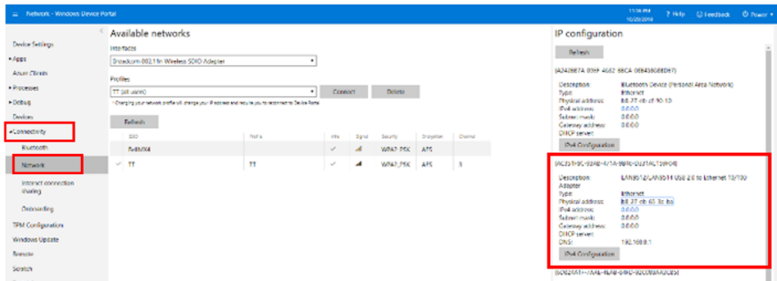

-   On the right-hand side of the screen are listed all the types of network
    connections on the Raspberry Pi. Look for the one that starts Record the
    Physical address of your **LAN** card.

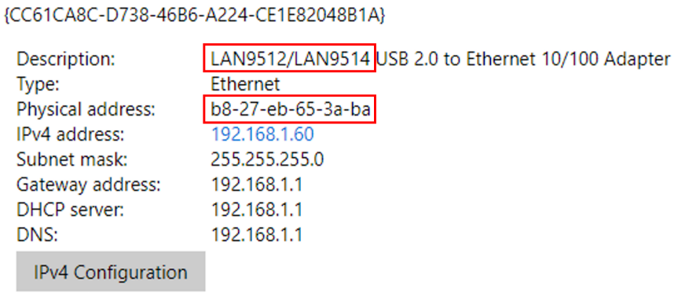

-   Look for the one that starts with LAN and record the **Physical address,
    without the dashes in between.** This is your unique device ID that is used
    as the claim code for device registration on the Student Kit Portal. In this
    example the **Device ID** is **b827eb653aba**

Next Steps
----------

You have now completed getting your devices powered up and online and have
collected your unique Device ID. Write this Device ID down for later use when
you need to register your device.

Next steps are to [install the FarmBeats Sensor Application Software](https://github.com/farmbeatslabs/studentkit/blob/master/Indoor-m1/1d_Install_the_FarmBeats_Sensor_Application_Software.md) onto the
Raspberry Pi.
