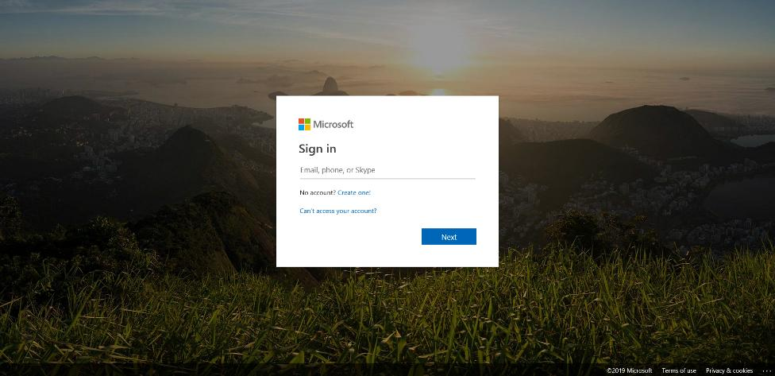
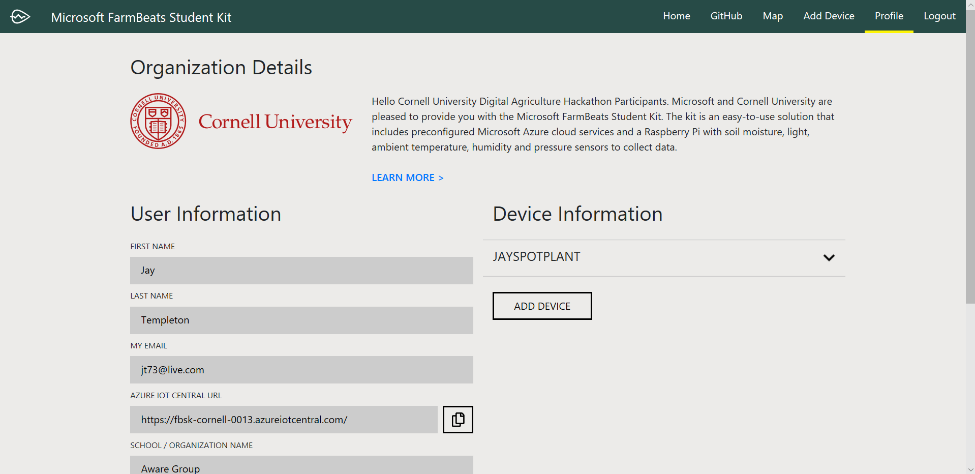

Register your FarmBeats Student Kit User and Device
===================================================

To get your FarmBeats Student Kit devices connected to the cloud you need to
register the unique ID from each device and get it provisioned to the Azure IoT
Central Cloud Service.

The FarmBeats Student Kit portal makes this easier for you by providing you with
a simple way to register your user and then your device so configuration of the
cloud service is done for you.

*Note: It is recommended that you start your web browser in a Private Mode to
avoid conflicts with the username that you might already being logged into other
sites with.*

Register your user at the FarmBeats Student Kit Portal
------------------------------------------------------

-   Please check the URL on the outside of the Student Kit or on the Getting
    Started Guide and visit the portal using that URL.

    -   If you have received your Student Kit from your school or other
        educational organization then it’s likely that you would have a
        customized registration process. E.g. <https://aka.ms/fbsk-schoolname>

    -   If you have received your Student Kit independent of an educational
        organization then just use the base URL of <https://aka.ms/fbsk>

-   To login for the first time click either the Login or the Activate Your Kit
    button on the home page. Note: In the top right of the page it will show if
    you are logged in already. If you are already logged in with an account that
    you don’t want to use for the Student Kit then log out and visit the page
    again.

-   At the login page, either select the account you want to log in with or use
    another account.

-   Enter your user name and password.

*Note: If you don’t already have a Microsoft Work or School account or a
Microsoft Account like an Outlook, Live or Hotmail user name then this process
will create a MSA on top of your existing email address.*

-   If it’s your first time logging in then you will be redirected to the User
    Registration Page. If you have logged in before you will need to select
    Activate your Kit from the Getting Started section.

-   On the registration page your name and email address will already be
    provided from your login account. Continue to fill in the remaining
    information.

-   If you are registered as part of an organization then you will need to also
    fill out any information the might be customized specific to the
    organization you are affiliated with.

-   *Note: when you try to type the address in the address field it’s only going
    to accept from the nearest town and not to the exact address.*

-   Once you have filled out the form you will need to select any confirmation
    boxes for policies on this page.

-   Submit the form to complete the account creation. You have now registered
    your user.

-   From there the next steps are to register your device or devices.

Register your devices
---------------------

-   To register your Student Kit device you are going to need a unique **Device
    ID** to use as the claim code. The Device ID that we use is from the Mac
    address of the LAN adapter on your Raspberry Pi. Instructions for obtaining
    the claim code are in part 1 of the instructions for setting up your device.

-   When you have registered your device, you will be redirected to the profile
    page.

-   If you have a second device to register you can do it here by pressing the
    “Add Device” button.
