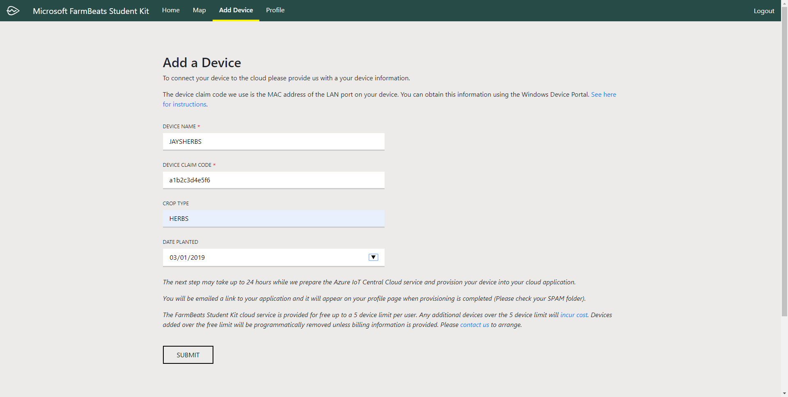
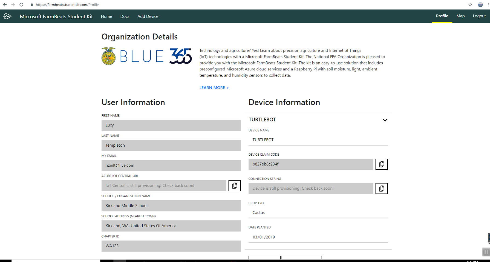

Register your FarmBeats Student Kit User and Device
===================================================

To get your FarmBeats Student Kit devices connected to the cloud you need to
register the unique ID from each device and get it provisioned to the Azure IoT
Central Cloud Service.

The FarmBeats Student Kit portal makes this easier for you by providing you with
a simple way to register your user and then your device so configuration of the
cloud service is done for you.

Register your user at the FarmBeats Student Kit Portal
------------------------------------------------------

-   Please check the URL on the outside of the Student Kit or on the Getting
    Started Guide and visit the portal using that URL.

    -   If you have received your Student Kit from your school or other
        educational organization then it’s likely that you would have a
        customized registration process. E.g. <https://aka.ms/fbsk-ffa>

    -   If you have received your Student Kit independent of an educational
        organization then just use the base URL of <https://aka.ms/fbsk>

-   To login for the first time click either the Login, Register or the Activate
    Your Kit button on the home page. Note: In the top right of the page it will
    show if you are logged in already. If you are already logged in with an
    account that you don’t want to use for the Student Kit then log out and
    visit the page again.

    

-   At the login page, either select the account you want to log in with or
    select + Use another account. Note: You have to use either a Work/School
    account that already has an Azure AD or Office 365 user setup, or a
    Microsoft Account (MSA).

-   Enter your user name and password. Note: If you don’t already have a
    Microsoft Work or School account or a Microsoft Account like an Outlook,
    Live or Hotmail user name then this process will create a MSA on top of your
    existing email address.

-   On the registration page your name and email address will already be
    provided from your login account. Continue to fill in the remaining
    information including any information the might be customized specific to
    the organization you are affiliated with. *Note: when you try to type the
    address in the address field it’s only going to accept from the nearest town
    and not to the exact address.*

-   Once you have filled out the form you will need to select any confirmation
    boxes for policies on this page.

-   Submit the form to complete the account creation. You have now registered
    your user.

-   From there the next steps are to register your device or devices.

Register your devices
---------------------

1.  To register your Student Kit device you are going to need a unique ID to use
    as the claim code. The unique ID that we use is from the Mac address of the
    LAN adapter on your Raspberry Pi. Instructions for obtaining the claim code
    are here.

When you have registered you will be redirected

