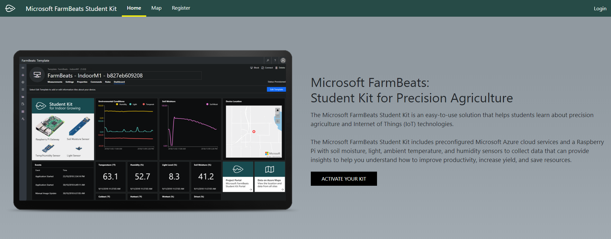
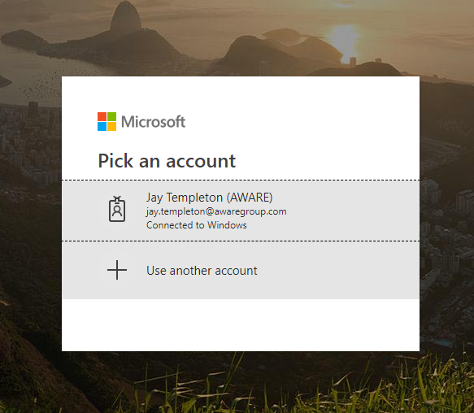
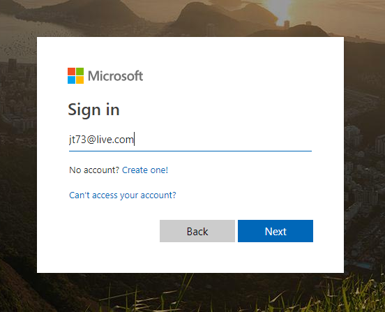
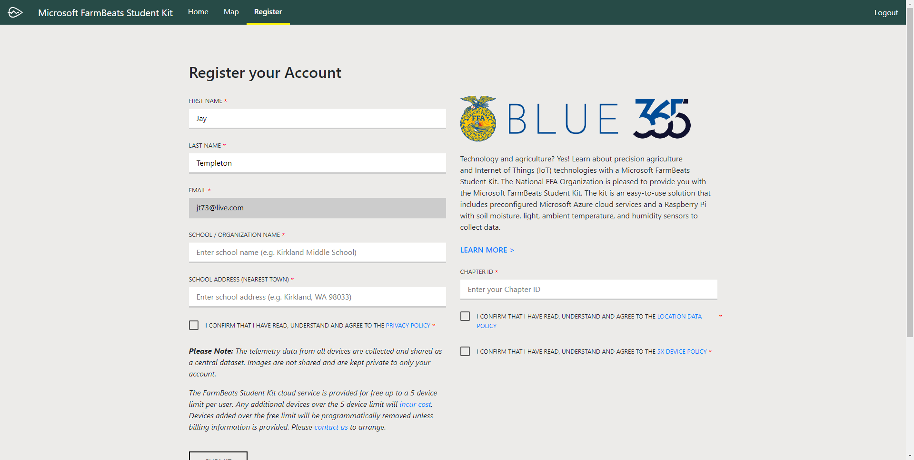
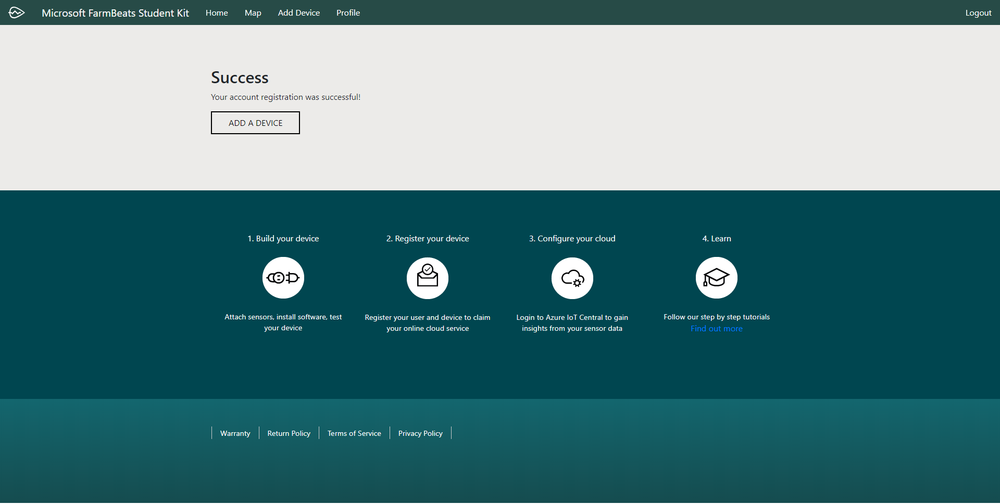

Register your FarmBeats Student Kit User and Device
===================================================

To get your FarmBeats Student Kit devices setup and connected to the cloud you
need to register the unique ID from each device and get it connected to the
Azure IoT Central Cloud Service.

The FarmBeats Student Kit portal makes this easier for you by providing you with
a simple way to register your user and then your device and then the complex
configuration of the cloud service is done for you.

Step 1 – Register your user at the FarmBeats Student Kit Portal

1.  Please check the URL on the outside of the Student Kit or on the Getting
    Started Guide and visit the portal using that URL.

    1.  If you have received your Student Kit from your school or other
        educational organization then it’s likely that you would have a
        customized registration process. E.g. <https://aka.ms/fbsk-ffa>

    2.  If you have received your Student Kit independent of an educational
        organization then just use the base URL of <https://aka.ms/fbsk>

2.  To login for the first time click either the Login, Register or the Activate
    Your Kit button on the home page. Note: In the top right of the page it will
    show if you are logged in already. If you are already logged in with an
    account that you don’t want to use for the Student Kit then log out and
    visit the page again.

1.  At the login page, either select the account you want to log in with or
    select + Use another account. Note: You have to use either a Work/School
    account that already has an Azure AD or Office 365 user setup, or a
    Microsoft Account (MSA).

1.  Enter your user name and password. Note: If you don’t already have a
    Microsoft Work or School account or a Microsoft Account like an Outlook,
    Live or Hotmail user name then this process will create a MSA on top of your
    existing email address.

1.  On the login page your name and email address will already be provided from
    your login account. Continue to fill in the remaining information including
    any information the might be customized specific to the organization your
    are affiliated with. *Note: when you try to type the address in the address
    field it’s only going to accept from the nearest town and not to the exact
    address.*

1.  Once you have filled out the form you will need to select the confirmation
    boxes for the 3 policies on this page.

    1.  Policy one is our privacy policy.

    2.  Location Data Policy – we will extract location data to the nearest town
        that will help us understand where the kits are being used around the
        world. Additional data with the current readings from your sensors is
        also showed on the global map but exact location or historical sensor
        data is not shared.

    3.  5 device policy – we

2.  When you have hit the submit button you will get a account creation success
    message. You have now registered your user. From there the next steps are to
    register your device or devices.

>   Register your devices
