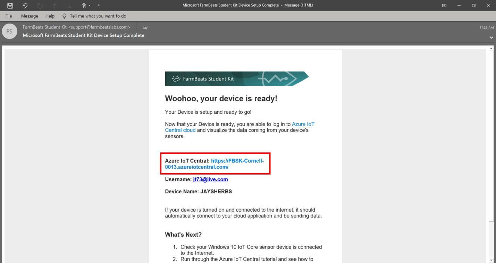
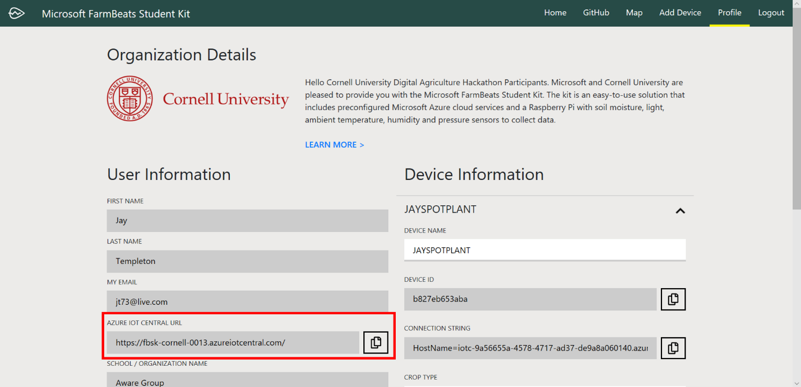
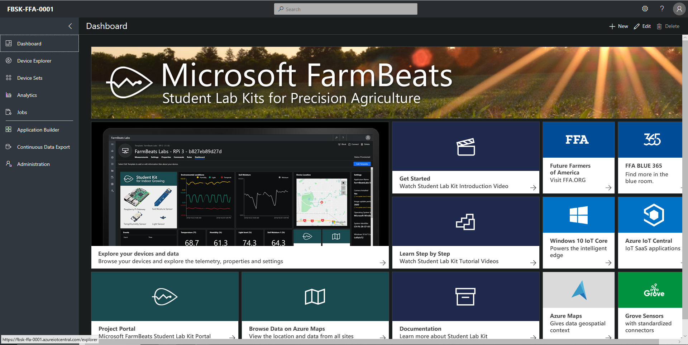

Configure your Azure IoT Central Cloud Service
==============================================

In this step you are going to log into your Azure IoT Central application for
the first time and configure it for your own usage.

For additional information and on Azure IoT Central you can view these
resources:

-   [Microsoft Azure IoT
    Central](https://azure.microsoft.com/en-us/services/iot-central/)

-   [Official Documentation
    Site](https://docs.microsoft.com/en-us/azure/iot-central/)

### Logging into your Azure IoT Central application

When your user account and device provisioning are completed you will get an
email that provides you with the Azure IoT Central application URL. This URL is
also available on your profile page on the FarmBeats Student Kit Portal.

-   Copy this URL to a new tab in your browser. If you are still logged into the
    Student Kit Portal the same user account will be used for the Azure IoT
    Central and login will happen automatically.

Configure the Azure IoT Central Dashboard
-----------------------------------------

### Test that your sensor data is being received. 

Cover the light sensor and click the commands, Sensor Update

Properties, update the location
