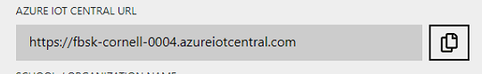
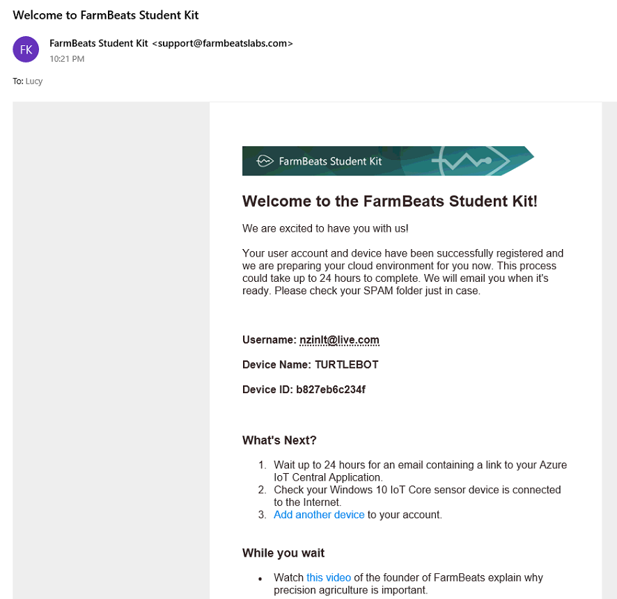
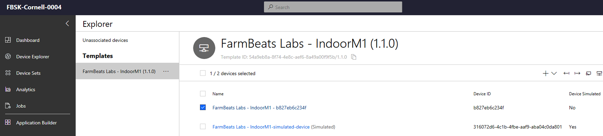
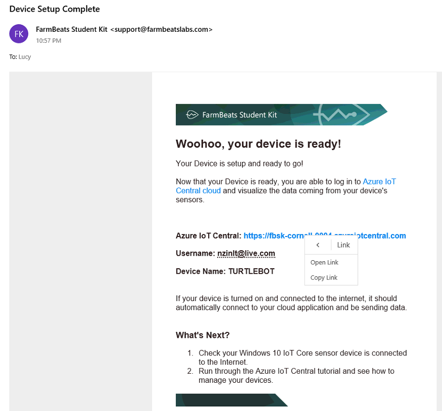

Configure your Azure IoT Central Cloud Service
==============================================

In this step you are going to log into your Azure IoT Central application for
the first time and configure it for your own usage.

For additional information and on Azure IoT Central you can view these
resources:

-   [Microsoft Azure IoT
    Central](https://azure.microsoft.com/en-us/services/iot-central/)

-   Official Documentation site

Instructions for Configuring Azure IoT Central

When your user account and device provisioning are completed you will get an
email that provides you with the Azure IoT Central application name.

Test

Cover the light sensor and click the commands, Sensor Update

Properties, update the location

