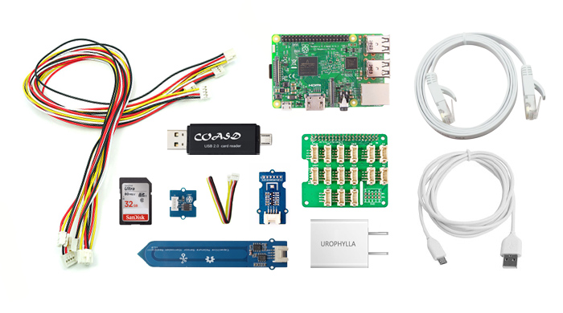
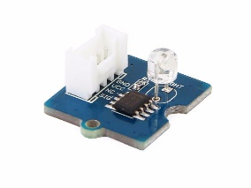
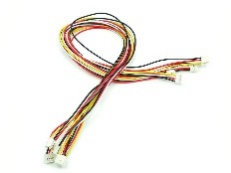
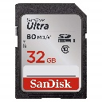
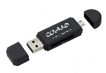
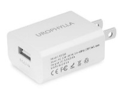
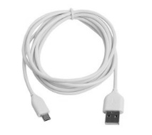
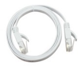

FarmBeats Student Kit: Indoor M1 Hardware
=========================================

This is all the hardware that ships in the FarmBeats Student Kit: Indoor M1.

Parts list:

Raspberry Pi 3 Model B

[Raspberry Pi Model
3B](https://www.seeedstudio.com/Raspberry-Pi-3-Model-B-p-2625.html)

The Raspberry Pi is the main board for learning, coding, and creating in our
FarmBeats student kit.

Grove Base Hat for Raspberry Pi

[Grove Base Hat for Raspberry
Pi](https://www.seeedstudio.io/Grove-Base-Hat-for-Raspberry-Pi-p-3186.html)

The Grove Base Hat for Raspberry Pi allows you to add analog, digital and I2C
sensors.

Grove - Temp&Humi&Barometer Sensor (BME280)

[Grove Temperature, Humidity and Barometric Pressure
Sensor](https://www.seeedstudio.io/Grove-Temp%26Humi%26Barometer-Sensor-%28BME280%29-p-2653.html)

The BME 280 is a Bosch, three-in-one, high-precision environmental sensor.

A circuit board Description generated with high confidence

[Grove Capacitive Soil Moisture
Sensor](https://www.seeedstudio.com/Grove-Capacitive-Moisture-Sensor-Corrosion-Resistant-p-2850.html)

The soil moisture sensor measurements are based on capacitance changes.

Grove - Light Sensor v1.2

[Grove Light
Sensor](https://www.seeedstudio.com/Grove-Light-Sensor-v1-2-p-2727.html)

The Light Sensor is designed to measure light levels.

Grove - Universal 4 Pin Buckled 50cm Cable (5 PCs Pack)

[Grove 50cm Long
Cable](https://www.seeedstudio.com/Grove-Universal-4-Pin-Buckled-50cm-Cable-5-PCs-Pac-p-928.html)

The Universal 4 Pin Buckled Cable allows you to connect all of the components.

https://images-na.ssl-images-amazon.com/images/I/61RLNh5Af2L.SL1100.jpg

[SD Card 32GB
Fast](https://www.amazon.com/SanDisk-Ultra-Class-Memory-SDSDUNC-032G-GN6IN/dp/B0143RT8OY/ref=sr_1_6?ie=UTF8&qid=1537124895&sr=8-6&keywords=sd+card+32)

[SD Card Reader](https://www.amazon.com/gp/product/B01KFXS83W)

[USB Power
Supply](https://www.amazon.com/Charger-UROPHYLLA-Portable-compatible-Samsung/dp/B06X9PY6RT)

[USB Power Cable](https://www.amazon.com/gp/product/B07BPYGBBV)

[Ethernet LAN Cable](https://www.amazon.com/gp/product/B01IQWGI04)
