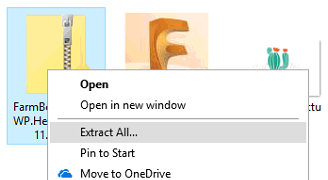
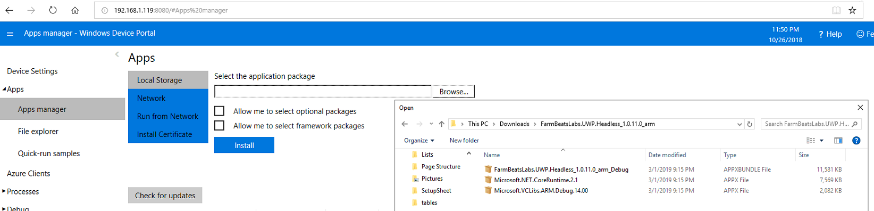
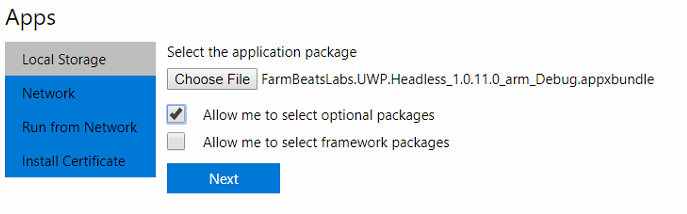
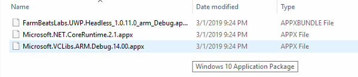
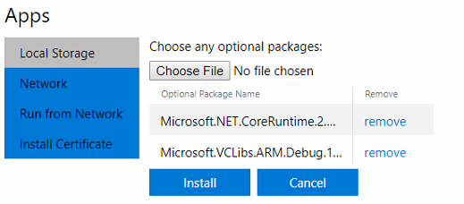
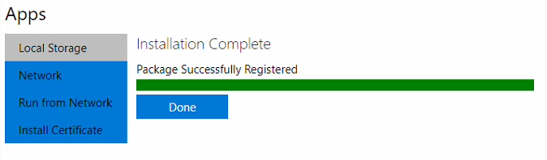
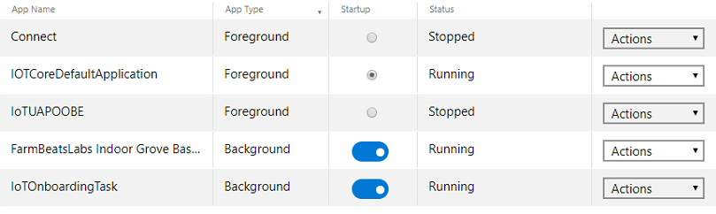

Install the FarmBeats Sensor Application Software
-------------------------------------------------

The sensor application is the piece of software that reads the values from the
sensors and sends them to the cloud. The sensor application is critical to the
supply of data from the device and into Azure IoT Central.

Preparation
-----------

Before going through the installation guide below, ensure that your device is
connect to the internet and you have retrieved your device IP address. If you
are missing these steps please refer to the Identifying your Unique Device ID
guide.

**Download the software**

To complete these steps, you will need a keyboard, monitor and computer mouse.

-   Download the latest [FarmBeats Labs Sensor Application for the Indoor
    M1](https://fblassets.blob.core.windows.net/releases/FarmBeatsLabs.UWP.Headless_1.0.11.0_arm.zip)
    software.

-   Unzip the contents of the zip file to a folder on your PC or laptop.

**Open the App Manager in the Windows Device Portal**

-   Open the Windows Device Portal. This can be done by opening a web browser
    and typing in your device IP address (found in previous step by step
    instructions) followed by 8080 (eg. http://192.168.1.60:8080)

-   In the Windows Device Portal, Select **Apps** on the left menu ad then **App
    manager**

**Install the FarmBeats Sensor Application Software**

-   Select **[Choose File]** button in the **“Select the application package”**

-   Browse to the location of the downloaded files and select the file ending in
    starting with **FarmBeatsLabs** and ending in **.appxbundle** file.

-   Select the **“Allow me to select optional packages”** and click **Next**

-   Select the **[Choose File]** button, and select
    Microsoft.NET.CoreRuntime2.1.appx

-   Select the **[Choose File]** again, and select
    Microsoft.VCLibs.ARM.Debug.14.00.appx

-   Click the **Install** button

-   The application will take a little while to upload and then will pause while
    it installs. When it has finished installing it will give you a **“Package
    Successfully Registered”** message at the end with it’s complete.

-   Click **Done**

-   The application should now show up in the Apps list.

-   Set the FarmBeatsLabs Indoor Grove Base Hat to **Startup** by switching the
    toggle. This will start the application when the device boots.

Software Installation Complete
------------------------------

You have successfully installed your Windows 10 IoT Core sensor device and
software

Now proceed to [Step 2 – Register your FarmBeats Student Kit User and
Device](https://github.com/farmbeatslabs/studentkit/blob/master/Indoor-m1/2_Register_your_FarmBeats_Student_Kit_User_and_Device.md)
