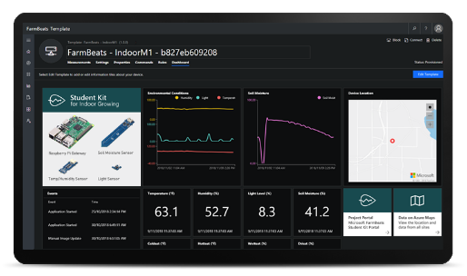

Microsoft FarmBeats Student Kit
===============================

Welcome to the Microsoft FarmBeats Student Kit repo here on GitHub.

The Microsoft FarmBeats Student Kits are easy-to-use solutions that help
students learn about precision agriculture and Internet of Things (IoT)
technologies.

[The first FarmBeats Student Kit, the Indoor
M1](https://github.com/farmbeatslabs/studentkit/blob/master/Indoor-m1/readme.md),
includes preconfigured Microsoft Azure cloud services and a Raspberry Pi with
soil moisture, light, ambient temperature, and humidity sensors to collect data
that can provide insights to help you understand how to improve productivity,
increase yield, and save resources.

We would love to hear from you for any successes or failures you experience
along the way.

We hope you enjoy using the kit.

The FarmBeats Student Kit team!
